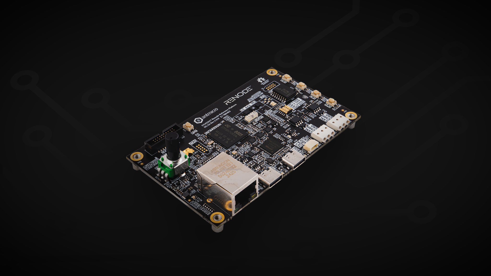

# STM32H7 Renode Reference Platform

Copyright (c) 2026 [Antmicro](https://www.antmicro.com)

## Overview

This project contains open hardware design files for an [STM32H7 Renode Reference Platform](https://designer.antmicro.com/library/devices/stm32h7_renode_reference_board). 
The board includes a high-performance 32-bit STM32H753 MCU and a group of sensors integrated into a development kit form factor. 
A digital twin of the board is represented in the [Renode](https://antmicro.com/platforms/renode) simulation framework, allowing users to experiment with and learn how to integrate Renode into the development process.

## Key features

* Powered via USB-C
* Dedicated debug/flashing USB-C port
* 100Mbit/s Ethernet
* DRP USB-C 
* 6-axis IMU
* Power consumption meter
* Temperature sensor
* Light intensity sensor
* 2x CAN bus terminal
* 1Gbit QSPI flash external memory
* QWIIC expansion connector

## Project structure

The main directory contains KiCad PCB project files, the LICENSE, and this README, and the img directory contains graphics for this README.

## Licensing

This project is published under the [Apache-2.0](LICENSE) license.
