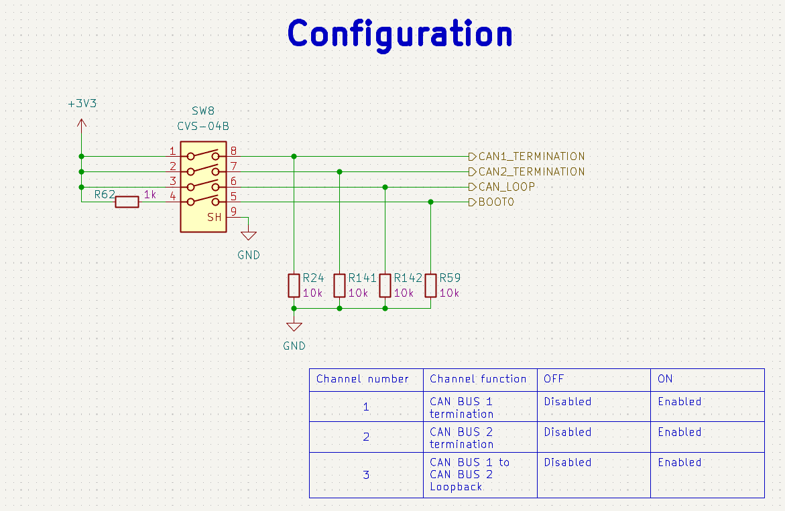
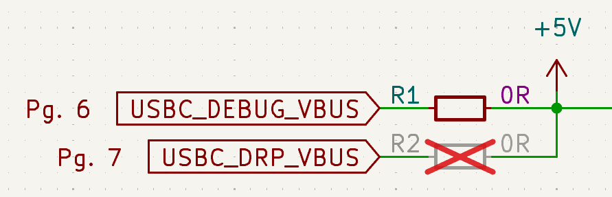
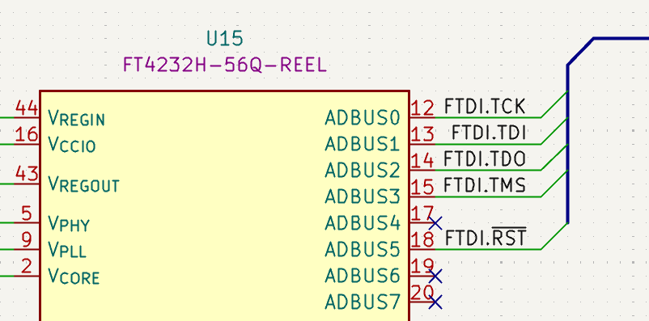
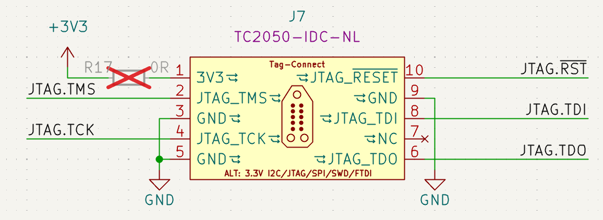
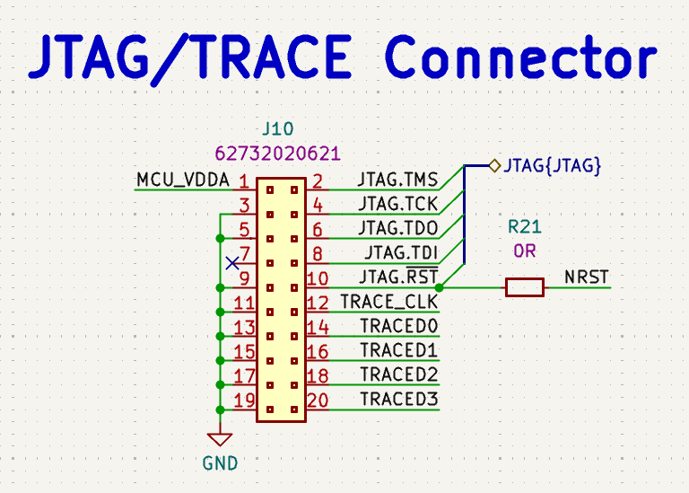

# Board overview

STM32H7 Renode Reference Platform is an open hardware board design implementing `STM32H7` MCU family. The board design files were created in KiCad 9.x. A digital twin of the board is represented in the Renode simulation framework, allowing users to experiment and learn how to integrate Renode into the development process.

You can find out more by visiting portals listed below:
* [Open Hardware Portal](https://openhardware.antmicro.com/boards/stm32h7-renode-reference-platform/?tab=features)
* [System Designer](https://designer.antmicro.com/library/devices/stm32h7-renode-reference-platform?hw-release=rev.1.0.0) 
* [Github](https://github.com/antmicro/stm32h7-renode-reference-platform)

[Open Hardware Portal](https://openhardware.antmicro.com/boards/stm32h7-renode-reference-platform/?tab=features) provides 3D renders, board stackup definition, as well as an interactive preview of the board schematic and layout.

## IO Map

### Buttons, switches, potentiometers

STM32H7 Renode Reference Platform features multiple buttons and switches allowing the user to interface with the MCU and other board peripherals. 
* 4 independent user buttons - SW1-SW4 (mapped in DTS as sw0-sw3)
* MCU Reset button - SW5
* Slide switch - SW8
  * Position 1 - Disable/Enable CAN 1 termination
  * Position 2 - Disable/Enable CAN 2 termination
  * Position 3 - Disable/Enable connection between CAN 1 and CAN 2 Buses
  * Position 4 - MCU Boot0 control - Normal operation or bootloader entry
* User potentiometer - POT1


### User LEDs

Board includes multiple LEDs to allow the user to output visual information.
* 4 independent green LEDs - D1-D4 (mapped as pwm-led0-pwm-led3)
* 1 RGB LED - D5 (mapped as led0-led3 as 3 individual LEDs - red, green and blue)


### Sensors

Board implements multiple sensors allowing the user to read data about board's behavior and state.

* 6-axis IMU (Acc + Gyro) - [LSM6DSO32TR](https://www.st.com/en/mems-and-sensors/lsm6dso32.html) - U4
* 3-axis Magnetometer - [IIS2MDCTR](https://www.st.com/en/mems-and-sensors/iis2mdc.html) - U3
* Barometer - [LPS25HBTR](https://www.st.com/en/mems-and-sensors/lps25hb.html) - U6
* Temperature sensor - [TMP108AIYFFR](https://www.ti.com/product/TMP108/part-details/TMP108AIYFFR) - U5
* Light intensity sensor - [VEML7700](https://www.vishay.com/en/product/84286/) - U11
* Current sensor:
  * [INA187A2IDBVR](https://www.ti.com/product/INA187) - U23
  * [INA228AQDGSRQ1](https://www.ti.com/product/INA228) - U24
  


#### I2S sensor map

Most of the sensors communication is done via `I2C` protocol on `i2c-0` bus. 

List of I2C addresses:
* LSM6DSO32TR - 0x5A
* IIS2MDCTR - 0x1E
* LPS25HBTR - 0x5D
* TMP108AIYFFR - 0x48
* VEML7700 - 0x10

```
  |      0    1    2    3    4    5    6    7    8    9    A    B    C    D    E    F  |
--|------------------------------------------------------------------------------------|
00|     --   --   --   --   --   --   --   --   --   --   --   --   --   --   --   --  |
10|     10   --   --   --   --   --   --   --   --   --   --   --   --   --   1e   --  |
20|     --   --   --   --   --   --   --   --   --   --   --   --   --   --   --   --  |
30|     --   --   --   --   --   --   --   --   --   --   --   --   --   --   --   --  |
40|     --   --   --   --   --   --   --   --   48   --   --   --   --   --   --   --  |
50|     --   --   --   --   --   --   --   --   --   --   --   --   --   5d   --   --  |
60|     --   --   --   --   --   --   --   --   --   --   6a   --   --   --   --   --  |
70|     --   --   --   --   --   --   --   --   --   --   --   --   --   --   --   --  |
```

### Connectors

Design implements multiple connectors allowing the user to interface with the board and attach auxiliary devices.

* USB-C DEBUG - J1
* USB-C User - J2 
* Ethernet - J3
* QWIIC I2C expansion - J8 
* CAN bus - J5, J6
* Trace and JTAG - J10
* QSPI Flash access - J4


## CAN Bus

STM32H7 Renode Reference Platform is equipped with two separate CAN FD `TCAN3414DR` transceivers. With `SW8` you can manipulate the CAN termination.

Apart from the CAN bus termination, you are also able to connect two buses together to work as a loopback interface.



Connection to the CAN Bus with a auxiliary devices can be done with `J5` and `J6` `WAGO_2059` connectors. These connectors allow to connect standard prototyping cables without any additional tools.

```{note}
Remember to tie GND with devices connected to CAN Bus transceivers to avoid floating ground or unexpected ground loops.
```

## Power

By default STM32H7 Renode Reference Platform is powered via `USB-C DEBUG` connector. Plug the board to the standard PC USB slot or power it via USB-C charger.

Alternatively design gives option to switch the power supplying port from `USB-C DEBUG` to user `USB-C` connector. This can be done by changing resistor configuration between `R1` and `R2`.


### Power consumption monitoring

The board is able to monitor it's power consumption via two independent current monitors. 

U23 `INA187` is connected to `STM32H753`'s analog input feeding information into firmware running on the MCU.

U24 gives you ability to read the power consumption via `USB-C DEBUG` port directly from HOST device eliminating the need of use of the external measuring devices. It can be accessed via `FT4232H` channel B as I2C device. You can follow [FTDI Guide](https://ftdichip.com/Documents/AppNotes/AN_113_FTDI_Hi_Speed_USB_To_I2C_Example.pdf) for interfacing with I2C Bus and dive into [PyFtdi](https://eblot.github.io/pyftdi/) python library.

## Flashing

There are 3 options to flash the firmware into the MCU.


### FTDI FT4232H

The main flashing interface of the board is the [FTDI FT4232H](https://ftdichip.com/wp-content/uploads/2024/05/DS_FT4232H.pdf) USB bridge. This chip is connected to the `USB-C DEBUG` port and exposes JTAG interface for programming and debugging of the MCU.



Flashing via `FT4232H` chip was described in [Flash the board](getting_started.md#flash-the-board) chapter.

### 10-pin TagConnect

Alternative programming method is enabled via [10-pin TagConnect](https://www.tag-connect.com/info). Off the shelf `TC2050-IDC-NL` plug of nails can be used with most of the commercially available programmers giving developer an extra flexibility during the work with STM32H7 Renode Reference Platform. We recommend using TagConnect with Antmicro's [Debug Toolkit](https://openhardware.antmicro.com/boards/debug-toolkit/?tab=features)



```{note}
Remember to supply power the board before flashing as programming connector does not provide power to the device.
```

### 19-pin JTAG/SWD and Trace Connector

Third way to perform flashing of the `STM32H753` MCU is via standardized [19-pin JTAG/SWD and Trace Connector](https://kb.segger.com/19-pin_JTAG/SWD_and_Trace_Connector). This type of connector is widely used in `J-Trace Pro` programmers. Additionally it gives full capability of the trace debug interface.



