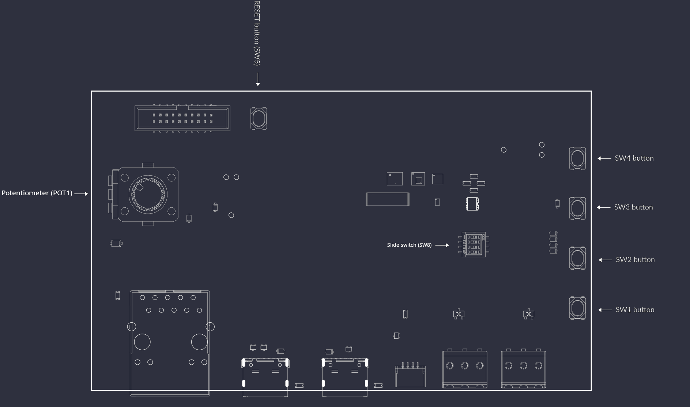
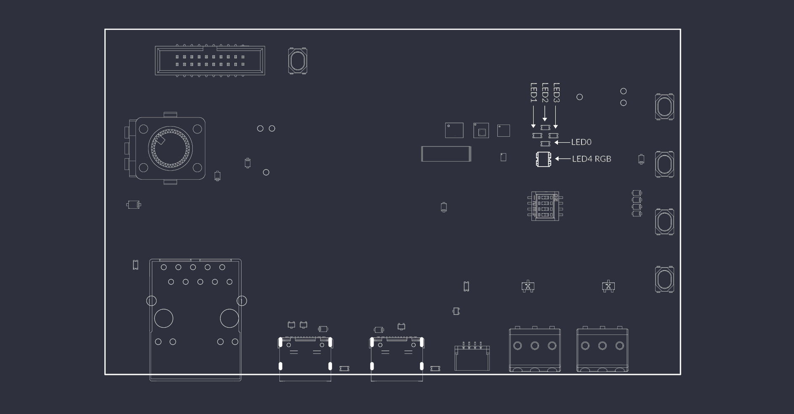
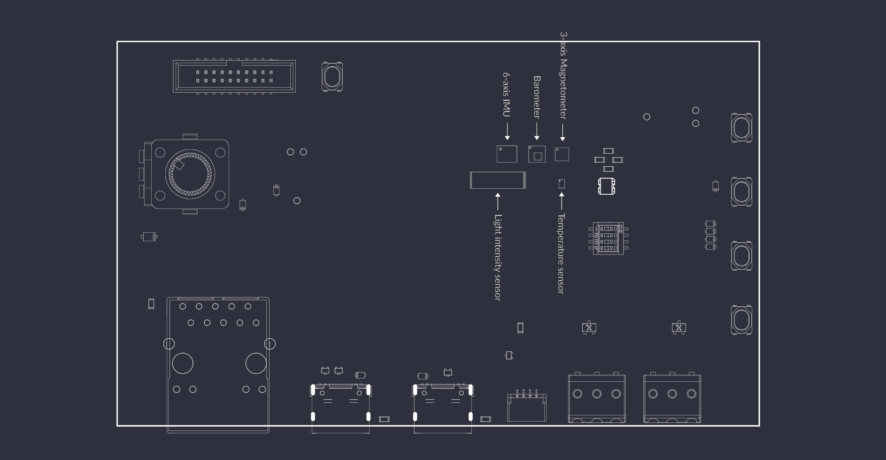
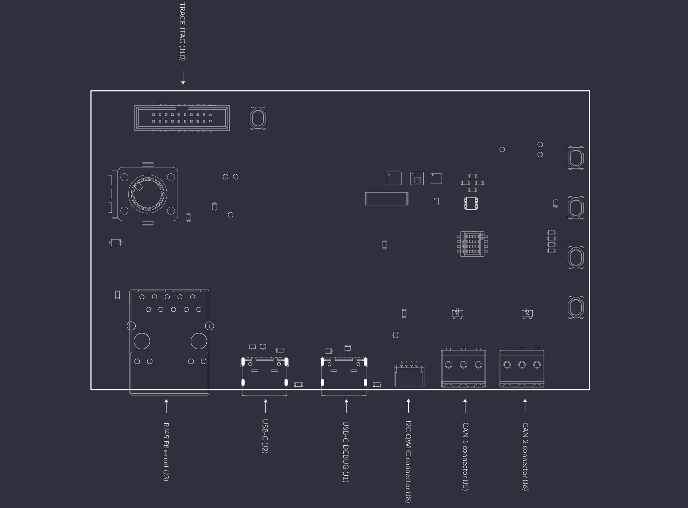
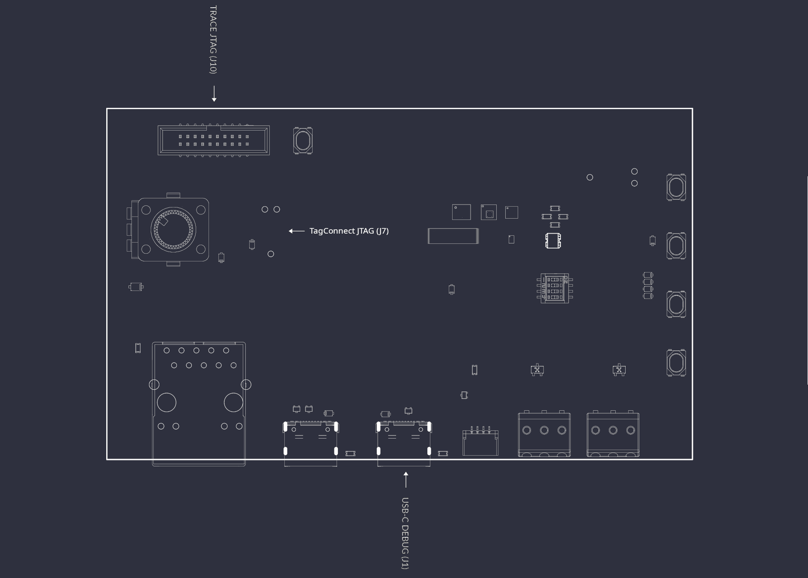

# Board overview

The STM32H7 Renode Reference Platform is an open hardware board implementing the `STM32H7` MCU family. The board design files were created in KiCad 9.x. A digital twin of the board is represented in the Renode simulation framework, allowing users to experiment with and learn how to integrate Renode into the development process.

You can find out more by visiting the portals listed below:
* [Open Hardware Portal](https://openhardware.antmicro.com/boards/stm32h7-renode-reference-platform/?tab=features)
* [System Designer](https://designer.antmicro.com/library/devices/stm32h7_renode_reference_board?hw-release=rev.1.1.2)
* [GitHub](https://github.com/antmicro/stm32h7-renode-reference-platform)

The [Open Hardware Portal](https://openhardware.antmicro.com/boards/stm32h7-renode-reference-platform/?tab=features) provides 3D renders, a board stackup definition, as well as an interactive preview of the board schematics and layout.

## I/O map

### Buttons, switches, potentiometers

The STM32H7 Renode Reference Platform features multiple buttons and switches allowing the user to interface with the MCU and other board peripherals.
* 4 independent user buttons - `SW1`-`SW4` (mapped in DTS as `sw0`-`sw3`)
* MCU reset button - `SW5`
* CAN bus termination slide switch - `SW8`
* User potentiometer - `POT1`



### User LEDs

The board includes multiple LEDs controlled from user space.
* 4 independent green LEDs - `D1`-`D4` (mapped as `pwm-led0`-`pwm-led3`)
* 1 RGB LED - `D5` (mapped as `led0`-`led2` as 3 individual LEDs - red, green and blue)



### Sensors

The board implements multiple sensors allowing the user to read data about the board's behavior and state.

* 6-axis IMU (Acc + Gyro) - [`LSM6DSO32TR`](https://www.st.com/en/mems-and-sensors/lsm6dso32.html) - `U4`
* 3-axis magnetometer - [`IIS2MDCTR`](https://www.st.com/en/mems-and-sensors/iis2mdc.html) - `U3`
* Barometer - [`LPS25HBTR`](https://www.st.com/en/mems-and-sensors/lps25hb.html) - `U6`
* Temperature sensor - [`TMP108AIYFFR`](https://www.ti.com/product/TMP108/part-details/TMP108AIYFFR) - `U5`
* Light intensity sensor - [`VEML7700`](https://www.vishay.com/en/product/84286/) - `U11`
* Current sensor:
  * [`INA187A2IDBVR`](https://www.ti.com/product/INA187) - `U23`
  * [`INA228AQDGSRQ1`](https://www.ti.com/product/INA228) - `U24`



#### I2C address map

All the sensors listed above, except for the current monitors, communicate with the `STM32H7` via the `I2C` protocol on the `i2c-0` bus. `U23` is connected to an `ADC` input of the MCU, while `U24` is reachable over `I2C` only through `FT4232H` (see [Power consumption monitoring](#power-consumption-monitoring)). The `QWIIC` expansion connector (`J8`) is connected to a separate bus.

The `I2C` addresses of the on-board sensors (7-bit) are:
* `LSM6DSO32TR` - `0x6A`
* `IIS2MDCTR` - `0x1E`
* `LPS25HBTR` - `0x5D`
* `TMP108AIYFFR` - `0x48`
* `VEML7700` - `0x10`

The map below shows the addresses occupied on the `i2c-0` bus.

```
  |      0    1    2    3    4    5    6    7    8    9    A    B    C    D    E    F  |
--|------------------------------------------------------------------------------------|
00|     --   --   --   --   --   --   --   --   --   --   --   --   --   --   --   --  |
10|     10   --   --   --   --   --   --   --   --   --   --   --   --   --   1e   --  |
20|     --   --   --   --   --   --   --   --   --   --   --   --   --   --   --   --  |
30|     --   --   --   --   --   --   --   --   --   --   --   --   --   --   --   --  |
40|     --   --   --   --   --   --   --   --   48   --   --   --   --   --   --   --  |
50|     --   --   --   --   --   --   --   --   --   --   --   --   --   5d   --   --  |
60|     --   --   --   --   --   --   --   --   --   --   6a   --   --   --   --   --  |
70|     --   --   --   --   --   --   --   --   --   --   --   --   --   --   --   --  |
```

### Connectors

The board implements multiple connectors allowing the user to interface with the board and attach auxiliary devices.

* USB-C DEBUG - `J1`
* USB-C user - `J2`
* Ethernet - `J3`
* QSPI flash access - `J4`
* CAN bus - `J5`, `J6`
* QWIIC I2C expansion - `J8`
* Trace and JTAG - `J10`



## CAN bus

The STM32H7 Renode Reference Platform is equipped with two separate CAN FD `TCAN3414DR` transceivers. With `SW8` you can manipulate CAN termination.
Apart from the CAN bus termination, you can also connect the two buses together to use them as a loopback interface.

For `SW8` switching logic, refer to the table below. An exact connection diagram can be found in the IOs schematic sheet.

| Channel number | Channel function | OFF | ON |
| -------------- | ---------------- | --- | -- |
| 1              | CAN bus 1 termination | Disabled | Enabled |
| 2              | CAN bus 2 termination | Disabled | Enabled |
| 3              | CAN bus 1 to CAN bus 2 loopback | Disabled | Enabled |

Connecting to the CAN bus with auxiliary devices can be done with the `J5` and `J6` `WAGO_2059` connectors. These connectors allow standard prototyping cables to be connected without any additional tools.

```{note}
Remember to tie GND with devices connected to the CAN bus transceivers to avoid a floating ground or unexpected ground loops.
```

## BOOT0 switch

The 4th channel of the `SW8` dip switch controls the BOOT0 signal. The BOOT0 pin determines the memory source from which the MCU boots after reset. When BOOT0 = OFF, it normally boots your program from Flash, and when BOOT0 = ON, it can boot the built-in System Memory bootloader.

## User USB

The `J2` USB connector is configured as an endpoint. The `USB-C` connector is used to connect the board to a USB host, such as a PC. It can be used for functions such as virtual COM port communication, firmware updates, or other USB device applications.

## Power

The STM32H7 Renode Reference Platform is powered via the `J1` (`USB-C DEBUG`) connector. Plug the board into a standard PC USB slot or power it via a USB-C charger.

```{note}
To power the board from the `J2` (`USB-C`) connector instead, remove the `R1` resistor and populate the `R2` resistor. Both positions use 0 Ohm 0402 resistors.
```

### Power consumption monitoring

The board is able to monitor its power consumption via two independent current monitors.

`U23` `INA187` is connected to the `STM32H753` analog input and feeds information into the firmware running on the MCU.

`U24` gives you the ability to read the power consumption directly from the host device via the `USB-C DEBUG` port, eliminating the need for external measuring devices. It can be accessed via the `FT4232H` channel B as an `I2C` device. You can follow the [FTDI Guide](https://ftdichip.com/Documents/AppNotes/AN_113_FTDI_Hi_Speed_USB_To_I2C_Example.pdf) for more information on interfacing with the `I2C` bus and learn more about the PyFtdi Python library from the [project documentation](https://eblot.github.io/pyftdi/).

## Flashing

There are 3 options to flash firmware into the MCU.



### FTDI (`FT4232H`)

The main flashing interface of the board is the [FTDI `FT4232H`](https://ftdichip.com/wp-content/uploads/2024/05/DS_FT4232H.pdf) USB bridge. This chip is connected to the `USB-C DEBUG` port and exposes a JTAG interface for programming and debugging of the MCU.

Flashing via the `FT4232H` chip is described in the [Flash the board](getting_started.md#flash-the-board) chapter.

### 10-pin Tag-Connect

An alternative programming method is available via the [10-pin Tag-Connect](https://www.tag-connect.com/info) terminal (`J7`). An off-the-shelf `TC2050-IDC-NL` Tag-Connect cable can be used with most commercially available programmers, giving developers extra flexibility when working with the STM32H7 Renode Reference Platform. We recommend using the Tag-Connect with Antmicro's [Debug Toolkit](https://openhardware.antmicro.com/boards/debug-toolkit/?tab=features).

```{note}
Note that `J7` is not to be confused with `J4`, the Tag-Connect terminal that provides access to the QSPI flash.
```

The `J7` Tag-Connect pinout is described in the table below:

| Signal name | Pin | Pin | Signal name |
| ----------- | --- | --- | ----------- |
| `3V3`       | 1   | 10  | `JTAG nRST` |
| `JTAG TMS`  | 2   | 9   | `GND`       |
| `GND`       | 3   | 8   | `JTAG TDI`  |
| `JTAG TCK`  | 4   | 7   | `nc`        |
| `GND`       | 5   | 6   | `JTAG TDO`  |

```{note}
Remember to supply power to the board before flashing, as the programming connector does not provide power to the device.
```

### 19-pin JTAG/SWD and Trace Connector

The third way to flash the `STM32H753` MCU is via a standardized [19-pin JTAG/SWD and Trace Connector](https://kb.segger.com/19-pin_JTAG/SWD_and_Trace_Connector) (`J10`). This type of connector is widely used in `J-Trace Pro` programmers. Additionally, it gives access to the trace debug interface, with 4 trace data lines exposed.

The `J10` JTAG/SWD and Trace connector pinout is described in the table below:

| Signal name | Pin | Pin | Signal name |
| ----------- | --- | --- | ----------- |
| `MCU_VDDA` | 1   | 2   | `JTAG TMS`     |
| `GND`       | 3   | 4   | `JTAG TCK`     |
| `GND`       | 5   | 6   | `JTAG TDO`     |
| `nc`        | 7   | 8   | `JTAG TDI`     |
| `GND`       | 9   | 10  | `JTAG nRST`    |
| `GND`       | 11  | 12  | `TRACE CLK`    |
| `GND`       | 13  | 14  | `TRACE DATA0`  |
| `GND`       | 15  | 16  | `TRACE DATA1`  |
| `GND`       | 17  | 18  | `TRACE DATA2`  |
| `GND`       | 19  | 20  | `TRACE DATA3`  |

```{note}
Remember to supply power to the board before flashing, as the programming connector does not provide power to the device.
```
