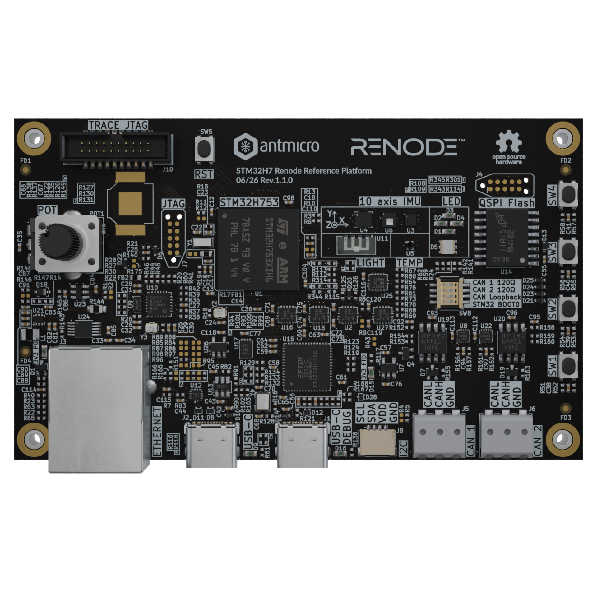
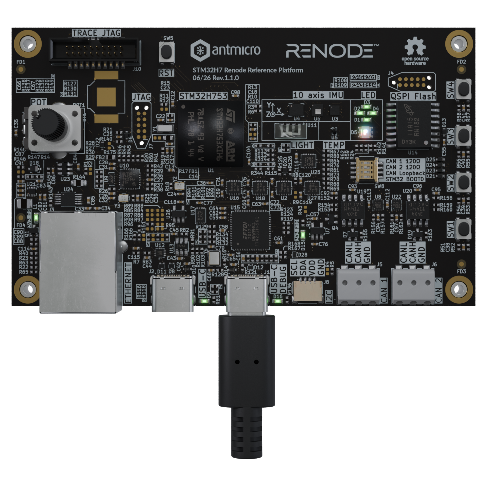

# Getting started guide

This manual will guide you through the initial setup of the open hardware STM32H7 Renode Reference Platform. It describes the basic steps required to operate the board, create working Zephyr code examples and run the digital twin in [Renode](https://renode.readthedocs.io/en/latest/). If you want to learn more about the STM32H7 Renode Reference Platform itself, go to the Board Overview section. That section also includes an I/O map that may come in handy when locating interface connectors mentioned in this guide.

## Collect the hardware

To get started with STM32H7 Renode Reference Platform you'll need the following hardware:

1. **STM32H7 Renode Reference Platform hardware**



2. **Power supply**
   
   STM32H7 Renode Reference Platform requires USB-C 5V power supply for operation. Power can be delivered both by dedicated USB Charger or a PC USB port. By default the `USB-C DEBUG` ports is used to power the board but hardware modification described in [](board_overview.md#power) enables powering via user `USB-C` port.

3. **Host PC**
   
   You will need a computer running Linux for flashing firmware to the STM32 MCU when following this guide. This was verified with Debian based system. You may need to introduce minor adjustments for other Linux distributions.

4. **Cabling**
    
   At least one USB-C Cable is required to power and operate the board. With one cable you are able to both flash and debug the device via integrated UART to USB bridge.

## Flash the board

You can run basic [Zephyr examples](https://docs.zephyrproject.org/latest/samples/index.html).
Dedicated OOT target has been prepared in [Demo app repository](https://github.com/antmicro/stm32h7-renode-reference-platform-zephyr)


### Install openocd

You need to have an [OpenOCD](https://github.com/openocd-org/openocd) installed to flash the board with the use of integrated USB to JTAG bridge. Currently released version `0.12.0` lacks the proper support for the `STM32H7` MCU series. We recommend installing the tool from sources.

```
#Requirements for specific configure parameters, install if needed
sudo apt install texinfo libjim-dev

git clone git://git.code.sf.net/p/openocd/code openocd
cd openocd
git checkout e6752ecb #verified on that commit, should work on Master branch
./bootstrap
./configure --enable-ftdi --enable-stlink
make
sudo make install

```
You can verify installation calling `openocd` command:
```
$ openocd
Open On-Chip Debugger 0.12.0+dev-02541-ge6752ecbc (2026-06-05-15:08)
Licensed under GNU GPL v2
For bug reports, read
	http://openocd.org/doc/doxygen/bugs.html
embedded:startup.tcl:88: Error: Can't find openocd.cfg
Traceback (most recent call last):
  File "embedded:startup.tcl", line 88, in script
    find openocd.cfg
Info : Listening on port 6666 for tcl connections
Info : Listening on port 4444 for telnet connections
Error: Debug Adapter has to be specified, see "adapter driver" command

```

### OpenOCD configs
Before you can flash the board, OpenOCD needs to know exactly what hardware it is targeting. This is handled by configuration (.cfg) files. The tool requires two important configs, interface pin routing and information about the target.

Create the files in desired firmware directory with:
```
echo "#FT4232H
adapter driver ftdi
ftdi vid_pid 0x0403 0x6011

#JTAG on channel A
ftdi channel 0

# Use JTAG, TCK, TDI, TDO and TMS default mapping will be used
transport select jtag

# Use 100kHz, can be increased if it is working stable
adapter speed 100

# Pin mapping:
# ADBUS0 = TCK (OUTPUT / INIT LOW)
# ADBUS1 = TDI (OUTPUT / INIT LOW)
# ADBUS2 = TDO (INPUT)
# ADBUS3 = TMS (OUTPUT / INIT HIGH)
# ADBUS4 = NC
# ADBUS5 = nRESET (OUTPUT / INIT HIGH)

ftdi layout_init 0x28 0x2b

# nSRST mapped to ADBUS5
ftdi layout_signal nSRST -noe 0x20

#Drive the nRST/NRST pin during reset
reset_config srst_only srst_open_drain
" >> ft4232h-jtag.cfg
```
and
```
echo "# SPDX-License-Identifier: GPL-2.0-or-later

# script for stm32h7x family (dual flash bank)

# STM32H7xxxI 2Mo have a dual bank flash.
set DUAL_BANK 1

source [find target/stm32h7x.cfg]
" >> stm32h7x_dual_bank.cfg
```


### Power the device

Plug a USB-C cable to `USB-C DEBUG` port and connect that to the Host PC.



Verify that device is detected with `lsusb`:

```
$lsusb
(...)
Bus 001 Device 008: ID 0403:6011 Future Technology Devices International, Ltd FT4232H Quad HS USB-UART/FIFO IC
(...)
```


### Flash the firmware

At first, start with installing [Zephyr](https://docs.zephyrproject.org/latest/develop/getting_started/index.html), by following the `getting started` guide.

Initialize a west environment:
```
west init -l .
west update
```

Build the example, [blinky](https://docs.zephyrproject.org/latest/samples/basic/blinky/README.html) is used for this instruction:

```
west build -b stm32h7_renode_reference_board samples/basic/blinky -p always --board-root target-directory
```

```{note}
Target directory consist OOT target mentioned in [Flash the board chapter](#flash-the-board) 
```

Flash the target board with use of OpenOCD
```
sudo openocd -f ./ft4232h-jtag.cfg -f ./stm32h7x_dual_bank.cfg -c "init; program ./build/zephyr/zephyr.elf verify reset exit"

```

### Open debug console

Most of the Zephyr examples provides console log that allows user to easily identify if the firmware is flashed correctly into the MCU. STM32H7 Renode Reference Platform provides console access on the serial port. We suggest using `picocom` for console monitoring while flashing the device.

First we need to identify the proper com port. Check detected USB devices in dmesg:

```
$ sudo dmesg | grep FTDI
[90522.076308] usb 1-4: Manufacturer: FTDI
[90522.133565] usbserial: USB Serial support registered for FTDI USB Serial Device
[90522.133630] ftdi_sio 1-4:1.0: FTDI USB Serial Device converter detected
[90522.133882] usb 1-4: FTDI USB Serial Device converter now attached to ttyUSB0
[90522.133932] ftdi_sio 1-4:1.1: FTDI USB Serial Device converter detected
[90522.134117] usb 1-4: FTDI USB Serial Device converter now attached to ttyUSB1
[90522.134175] ftdi_sio 1-4:1.2: FTDI USB Serial Device converter detected
[90522.134402] usb 1-4: FTDI USB Serial Device converter now attached to ttyUSB2
[90522.134440] ftdi_sio 1-4:1.3: FTDI USB Serial Device converter detected
[90522.134630] usb 1-4: FTDI USB Serial Device converter now attached to ttyUSB3

```

In presented case `ftdi_sio 1-4:1.2:` device is attached to `ttyUSB2`. To monitor the console use:

```
sudo picocom -b 115200 /dev/ttyUSB2
```

Example console log:
```
$ sudo picocom -b 115200 /dev/ttyUSB2
picocom v3.1

port is        : /dev/ttyUSB2
flowcontrol 
   : none
baudrate is    : 115200
parity is      : none
databits are   : 8
stopbits are   : 1
escape is      : C-a
local echo is  : no
noinit is      : no
noreset is     : no
hangup is      : no
nolock is      : no
send_cmd is    : sz -vv
receive_cmd is : rz -vv -E
imap is        : 
omap is        : 
emap is        : crcrlf,delbs,
logfile is     : none
initstring     : none
exit_after is  : not set
exit is        : no

Type [C-a] [C-h] to see available commands
Terminal ready
*** Booting Zephyr OS build v4.3.0-129-ge7a7639d1f26 ***

```
